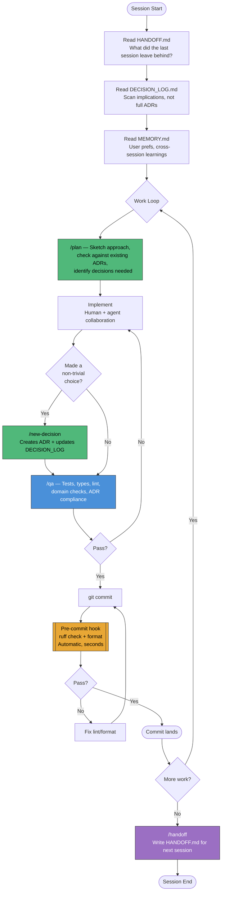
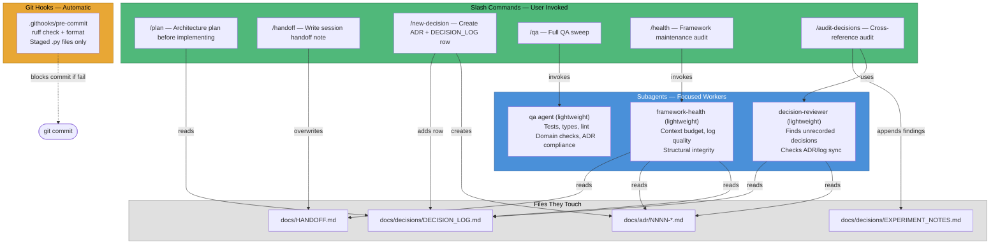
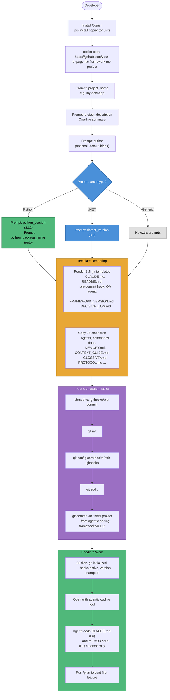
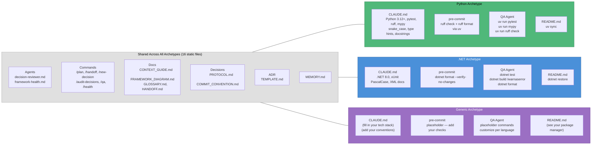
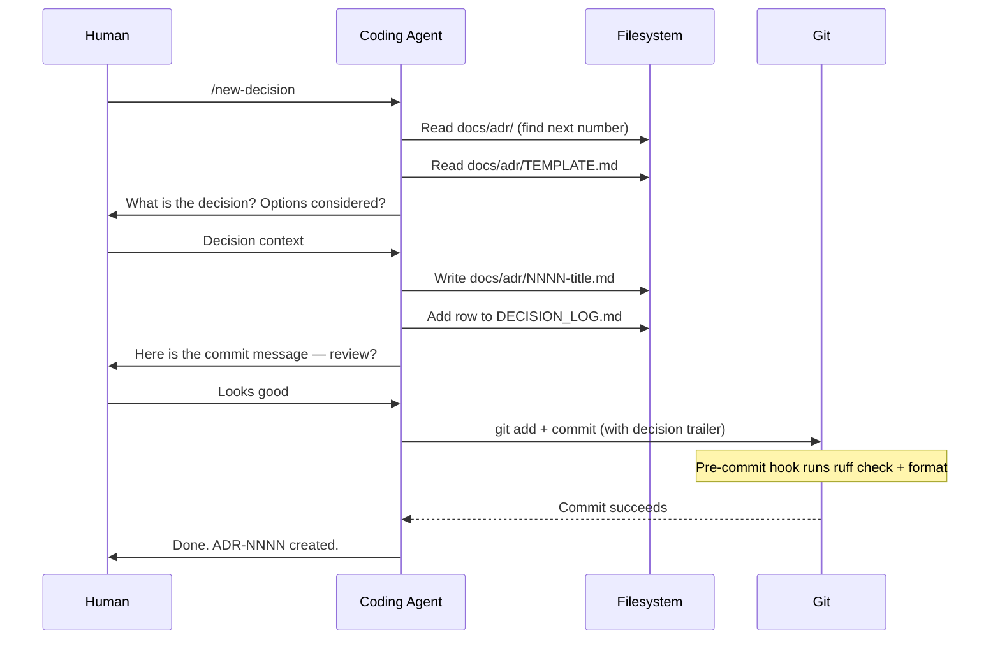

# Framework Diagrams

## Session Lifecycle

How a session flows from start to finish, and where agents/commands/hooks fire.

## Feature Workflow

What happens when a developer is asked to add a new feature — from request
to landed code. Shows which cache layers, commands, and hooks fire at each step.

```mermaid
flowchart TD
    REQUEST(["Feature request:
    'Add batch queue for encoding'"])

    REQUEST --> CONTEXT

    subgraph CONTEXT["1. Gather Context"]
        direction TB
        C1["CLAUDE.md (L0) — already loaded
        Conventions, architecture principles"]
        C2["MEMORY.md (L1) — already loaded
        User prefs (e.g. always use uv)"]
        C3["HANDOFF.md (L2) — read once
        Is anything in-progress that overlaps?"]
        C4["DECISION_LOG.md (L2) — scan implications
        Any existing decisions that constrain this?"]
        C1 --> C2 --> C3 --> C4
    end

    CONTEXT --> PLAN_CMD

    subgraph PLAN_CMD["2. /plan"]
        direction TB
        P1["Clarify scope with the developer"]
        P2["Check DECISION_LOG for constraints
        e.g. ADR-0003: must shell out to ab-av1"]
        P3["Sketch approach with file paths
        src/queue.py, src/worker.py, tests/..."]
        P4["Flag decisions that need recording
        e.g. concurrency model, error strategy"]
        P5["Estimate scope: S/M/L"]
        P1 --> P2 --> P3 --> P4 --> P5
    end

    PLAN_CMD --> NEED_ADR{"Plan surfaced
    decisions?"}

    NEED_ADR -->|Yes| ADR_FIRST["/new-decision
    Record before implementing
    e.g. ADR-0006: use asyncio task group"]
    NEED_ADR -->|No| BUILD

    ADR_FIRST --> BUILD

    subgraph BUILD["3. Implement"]
        direction TB
        B1["Write code
        Human + agent collaboration"]
        B2["Follow conventions from CLAUDE.md
        Type hints, pathlib, list-form subprocess"]
        B3["Read ADRs only if touching
        code they affect (L3, on demand)"]
        B1 --> B2 --> B3
    end

    BUILD --> MID_DECISION{"Made a
    non-trivial
    choice during
    implementation?"}

    MID_DECISION -->|Yes| MID_ADR["/new-decision
    Record it now, not later"]
    MID_DECISION -->|No| QA_CMD

    MID_ADR --> QA_CMD

    subgraph QA_CMD["4. /qa"]
        direction TB
        Q1["Tests — uv run pytest"]
        Q2["Types — uv run mypy"]
        Q3["Lint — uv run ruff check"]
        Q4["Domain checks — subprocess safety,
        encoding patterns"]
        Q5["ADR compliance — any unrecorded
        decisions in recent changes?"]
        Q1 --> Q2 --> Q3 --> Q4 --> Q5
    end

    QA_CMD --> QA_RESULT{All pass?}
    QA_RESULT -->|No| FIX["Fix issues"] --> QA_CMD
    QA_RESULT -->|Yes| GIT_COMMIT

    subgraph GIT_COMMIT["5. Commit"]
        direction TB
        GC1["git add (specific files)"]
        GC2["git commit with descriptive message
        + decision trailers if applicable"]
        GC3[["Pre-commit hook fires
        ruff check + ruff format
        Seconds, automatic"]]
        GC1 --> GC2 --> GC3
    end

    GIT_COMMIT --> HOOK_OK{Hook pass?}
    HOOK_OK -->|No| FIX_LINT["Fix lint/format"] --> GIT_COMMIT
    HOOK_OK -->|Yes| LANDED

    LANDED([Commit lands]) --> MORE{More work
    on this feature?}
    MORE -->|Yes| BUILD
    MORE -->|No| DONE

    subgraph DONE["6. Wrap Up"]
        direction TB
        D1["Feature complete"]
        D2["/handoff — write session note
        What was done, what to watch"]
        D1 --> D2
    end

    style CONTEXT fill:#50b87a,stroke:#2d7a4f,color:#000
    style PLAN_CMD fill:#50b87a,stroke:#2d7a4f,color:#000
    style BUILD fill:#e0e0e0,stroke:#999,color:#000
    style QA_CMD fill:#4a90d9,stroke:#2c5f99,color:#fff
    style GIT_COMMIT fill:#e8a735,stroke:#b07d1a,color:#000
    style DONE fill:#9b6fc3,stroke:#6b3f93,color:#fff
    style ADR_FIRST fill:#50b87a,stroke:#2d7a4f,color:#000
    style MID_ADR fill:#50b87a,stroke:#2d7a4f,color:#000
```

### Cache Layers Accessed During a Feature

Shows when each layer is read and why — most features never need to go past L2.

```mermaid
flowchart LR
    subgraph ALWAYS["Automatic — No Cost"]
        direction TB
        A_L0["L0: CLAUDE.md
        Conventions, principles, pointers
        Read: always"]
        A_L1["L1: MEMORY.md
        User prefs, learned patterns
        Read: always"]
    end

    subgraph ONCE["Read Once Per Feature"]
        direction TB
        O_L2A["L2: HANDOFF.md
        Read: at session start
        Why: check for overlap"]
        O_L2B["L2: DECISION_LOG.md
        Read: during /plan
        Why: check constraints via implications"]
    end

    subgraph ON_DEMAND["Only If Needed"]
        direction TB
        D_L3["L3: Individual ADR files
        Read: only if touching affected code
        Why: full rationale for a specific choice"]
        D_L4["L4: Git log
        Read: rarely, for audit trail
        Why: who changed what, when"]
        D_L5["L5: Code + comments
        Read: during implementation
        Why: understand existing behavior"]
    end

    ALWAYS ==>|"/plan triggers"| ONCE
    ONCE -.->|"only if relevant"| ON_DEMAND

    style ALWAYS fill:#50b87a,stroke:#2d7a4f,color:#000
    style ONCE fill:#4a90d9,stroke:#2c5f99,color:#fff
    style ON_DEMAND fill:#9b6fc3,stroke:#6b3f93,color:#fff
```

## Context Cache Hierarchy

Where information lives, ordered by access cost. Each layer contains enough
to decide whether to go deeper.

```mermaid
flowchart LR
    subgraph L0["Layer 0 — Always Loaded"]
        CLAUDE["CLAUDE.md (~65 lines)
        Project identity
        Conventions
        Pointers"]
    end

    subgraph L1["Layer 1 — Always Loaded"]
        MEMORY["MEMORY.md (~50 lines)
        User preferences
        Cross-session learnings"]
    end

    subgraph L2["Layer 2 — One Read Away"]
        HANDOFF_F["HANDOFF.md (ephemeral)
        Last session's state"]
        DLOG["DECISION_LOG.md
        Decision + Implication table"]
    end

    subgraph L3["Layer 3 — Two Reads Away"]
        ADR["ADR Files
        Full rationale, options,
        trade-offs, consequences"]
        DOCS["Detailed Docs
        PROTOCOL.md
        CONTEXT_GUIDE.md"]
    end

    subgraph L4["Layer 4 — Query On Demand"]
        GIT["Git Log
        Immutable audit trail
        When, who, what commit"]
    end

    subgraph L5["Layer 5 — Read On Demand"]
        CODE["Code + Comments
        Source of truth for
        what exists now"]
    end

    L0 --> L1 --> L2 --> L3 --> L4 --> L5

    style L0 fill:#50b87a,stroke:#2d7a4f,color:#000
    style L1 fill:#6ec98f,stroke:#2d7a4f,color:#000
    style L2 fill:#4a90d9,stroke:#2c5f99,color:#fff
    style L3 fill:#7baae0,stroke:#2c5f99,color:#000
    style L4 fill:#9b6fc3,stroke:#6b3f93,color:#fff
    style L5 fill:#b590d1,stroke:#6b3f93,color:#000
```

## Agent and Command Map

What each tool does and when it fires.

## Bootstrap: New Project Setup

How a new developer goes from zero to a fully configured project.

### What Gets Generated (by archetype)

## Decision Recording Flow

What happens when you run `/new-decision`.

