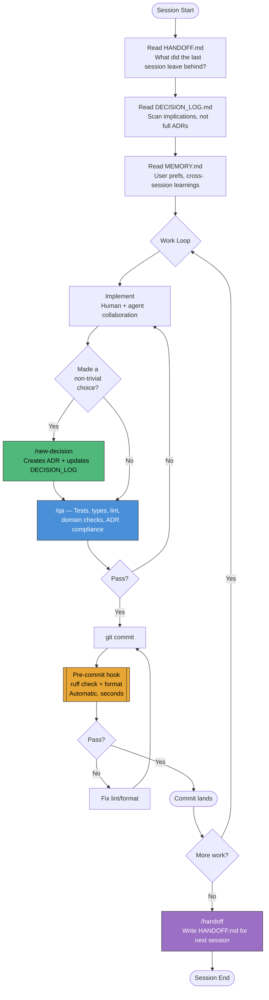
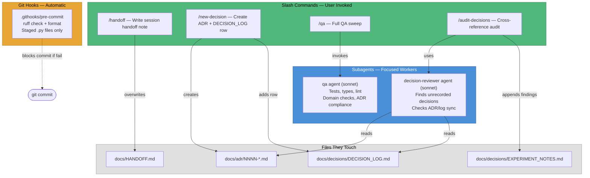

# Framework Diagrams

## Session Lifecycle

How a session flows from start to finish, and where agents/commands/hooks fire.

## Context Cache Hierarchy

Where information lives, ordered by access cost. Each layer contains enough
to decide whether to go deeper.

```mermaid
flowchart LR
    subgraph L0["Layer 0 — Always Loaded"]
        CLAUDE["CLAUDE.md (~65 lines)
        Project identity
        Conventions
        Pointers"]
    end

    subgraph L1["Layer 1 — Always Loaded"]
        MEMORY["MEMORY.md (~50 lines)
        User preferences
        Cross-session learnings"]
    end

    subgraph L2["Layer 2 — One Read Away"]
        HANDOFF_F["HANDOFF.md (ephemeral)
        Last session's state"]
        DLOG["DECISION_LOG.md
        Decision + Implication table"]
    end

    subgraph L3["Layer 3 — Two Reads Away"]
        ADR["ADR Files
        Full rationale, options,
        trade-offs, consequences"]
        DOCS["Detailed Docs
        PROTOCOL.md
        CONTEXT_GUIDE.md"]
    end

    subgraph L4["Layer 4 — Query On Demand"]
        GIT["Git Log
        Immutable audit trail
        When, who, what commit"]
    end

    subgraph L5["Layer 5 — Read On Demand"]
        CODE["Code + Comments
        Source of truth for
        what exists now"]
    end

    L0 --> L1 --> L2 --> L3 --> L4 --> L5

    style L0 fill:#50b87a,stroke:#2d7a4f,color:#000
    style L1 fill:#6ec98f,stroke:#2d7a4f,color:#000
    style L2 fill:#4a90d9,stroke:#2c5f99,color:#fff
    style L3 fill:#7baae0,stroke:#2c5f99,color:#000
    style L4 fill:#9b6fc3,stroke:#6b3f93,color:#fff
    style L5 fill:#b590d1,stroke:#6b3f93,color:#000
```

## Agent and Command Map

What each tool does and when it fires.

## Decision Recording Flow

What happens when you run `/new-decision`.

